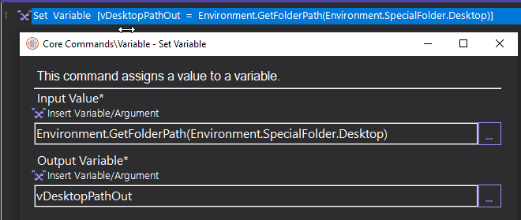
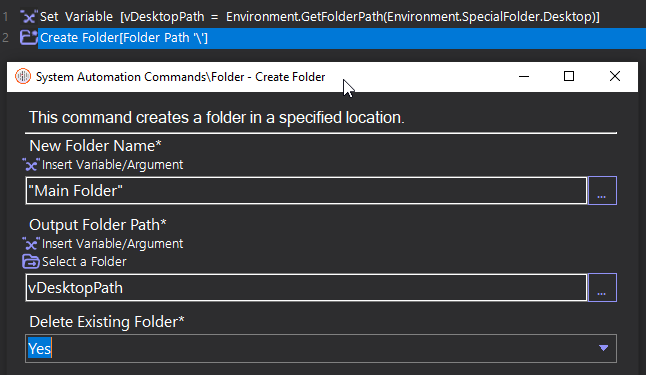

## Use set variable command 

Create path variable name ```vDesktopPath``` path in field ```Output Variable``` for store folder in desktop path like ```C:\desktop\folder```

```Ctrl + K``` to create variable

```csharp
vDesktopPath = Environment.GetFolderPath(Environment.SpecialFolder.Desktop)
``` 


## Use create folder command
- set folder name as a string `"Main Folder"` or in variable
- path vDesktoppath variable in field `Output Folder Path`
- Delete existing Folder choose `Yes`



